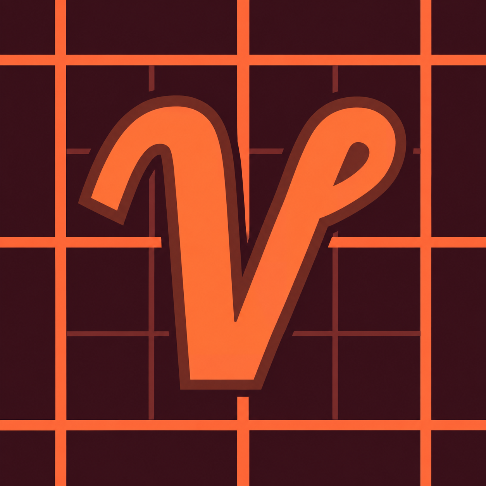

# Voxy Vulkan — Minecraft 26.3



封面基于官方 Voxy 原图魔改，已内嵌 JAR。PCL 当前依赖在线项目封面，
未发布的本地文件可能仍显示默认图标，见 [图标与 PCL 说明](docs/ICON.md)。

独立本地移植仓库，目标是 **Minecraft Java 26.3 正式版的原生 Vulkan 后端**。
已在 RTX 5060 Laptop 上通过真实世界中的原生 Vulkan 远景绘制、缓存恢复、
OIT、资源重载及三个原版维度往返测试。当前仍为开发版本，验证范围见
[实机记录](docs/VALIDATION-26.3.md)，不承诺所有显卡和模组组合均已验证。

基于 Voxyrium，合入社区 Vulkan 资源生命周期、VMA 分配与同步修复，
并保留官方 Voxy 的存储、区块摄入、模型烘焙、层级 LOD、远景与配置功能。
方块放置、移除和光照变化会按区段合并更新到远景缓存。
26.3 使用 RenderPearl 和 SDL，已经迁移对应 Java API；远景绘制在实体及
不透明地形之后、经典透明或 OIT 之前结束并恢复 Minecraft 的渲染通道。

## 构建

需要 JDK 25，使用仓库内 Gradle Wrapper：

```powershell
.\scripts\Build-26.3.ps1
```

脚本仅在当前进程里将 `HTTPS_PROXY` 传给 Java。输出位于 `build/libs/`。
Minecraft 26.3、Fabric Loader 0.19.5、Fabric API 0.160.6+26.3、
Sodium 0.9.2 的 Fabric 26.3 版本为基准依赖；LWJGL 与游戏对齐到 3.4.3。

## 隔离验证

```powershell
.\scripts\Build-26.3.ps1 -Smoke
# 安装 Vulkan SDK 的校验层后，运行完整的同步/生命周期/导入/移动检查：
.\scripts\Build-26.3.ps1 -Smoke -SyncValidation -Lifecycle -Import -Travel
```

独立测试模组仅存在于 `smokeTest` 源集，不打入 Voxy JAR。
游戏数据写入 `run-smoke/`，固定种子存档与截图都保存在该目录。
测试会自动创建或重开存档、移动观察点、保存截图并退出。
首次先运行基本测试以生成导入样本。完整测试只复制该测试存档的区域文件，
不会读取或写入 PCL 实例。脚本保存日志到 `artifacts/` 并检查失败标记。
同步检查会在测试模组内关闭 Minecraft 自身的 GPU 崩溃标记写入，以避开其
已有的同步报错；不关闭 Voxy 校验，也不会把这项测试改动打入发布 JAR。

本仓库不修改 `C:\Program Files also\PCL`。实际游玩请另外创建 26.3 测试实例，
安装构建出的 `voxy-vulkan-*.jar`、上述 Fabric API 和 Sodium，并在游戏设置中
选择 Vulkan 后重启，或使用游戏启动参数 `--graphicsBackend VULKAN`。

只验证 Minecraft 自带 Vulkan + 原生 Voxy 渲染路径。
保留的 OpenGL/Blaze3D 兼容代码及第三方 shader/VR/replay 集成未声明为
26.3 可用；旧的 Sodium OpenGL 通道注入已从此次注册清单移除。

同机位远景开关对照与实机截图：[开启](docs/evidence/lod-on.png)、
[关闭](docs/evidence/lod-off.png)、[OIT](docs/evidence/oit.png)、
[下界](docs/evidence/nether.png)、[末地](docs/evidence/end.png)。
这是已访问地形的 LOD 缓存，不会自动生成从未加载过的无限地形。

## 来源

完整来源与固定提交见 [移植记录](docs/PORTING-26.3.md)。
上游授权见 [LICENSE.md](LICENSE.md)，本地开发不改变上游授权。
