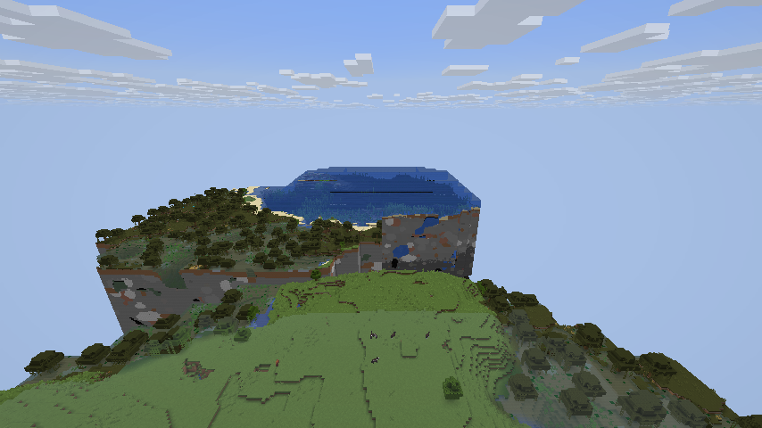
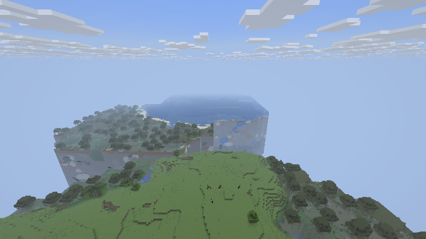

# Vulkan 近景与远景雾衔接修复

2026-09-17，版本 `0.2.20-26.3-vulkan.2-dev`。

## 原因与修复

用户截图中，原版近景有浅色环境雾，而 Voxy 远景突然恢复清晰。
Vulkan 合成器原先定义 `USE_ENV_FOG`，共享片段着色器实际检查 `HAS_FOG`，
导致虽然 CPU 已上传雾参数，远景的雾分支却没有编译进管线。

修复让 Vulkan 合成器使用共享着色器的 `HAS_FOG`，继续读取当前帧原版的
环境雾颜色、透明度、起止距离，并按重建出的世界距离计算雾强度。
保留原版环境氛围，不需要通过关闭全部雾来掩盖接缝。
原版视距截止雾仍由已有 Voxy 策略移除，让 LOD 能继续延伸。

同时恢复 `HAS_FADE` 与 Vulkan UBO 中缺失的 `fadeParams`，让默认
`FOG_AND_FADE` 和单独 `FADE` 模式的远景末端渐隐真正生效。
渐隐使用水平距离，位于 LOD 总视距的最后 10%，不会早于原版视距；
当有效渐隐区间长度为零时关闭该项，避免除零和 NaN。

雾浓度上限沿用原有 Voxy 策略：在 `max(原版视距, 320) × sqrt(3)`
对应的浓度处封顶。因此保留远景可见性，不声称与原版无限延伸的雾曲线
处处相同。水下、熔岩、失明等近距离浓雾仍沿用现有的遮蔽远景逻辑。

共享着色器约定可对照
[官方 Voxy 源码](https://github.com/MCRcortex/voxy/blob/534d58ec8b4aa412ef314b884295552c69d480a6/src/main/resources/assets/voxy/shaders/post/blit_texture_depth_cutout.frag)。

## 同机位画面

使用独立 `run-smoke/` 存档，种子 2632026，观察点 `(384.5, 150, 0.5)`，
朝向 `(90, 20)`，原版视距 10 区块。测试模组在原版大气雾计算之后、
Voxy 雾策略之前设置可重复的环境参数：起点 32、终点 512，颜色
`(0.65, 0.75, 0.9, 1)`。此参数仅在测试源集中，不打入发布 JAR。

修复前，远处树木和水面没有雾：



修复后，相同位置的远景随距离融入雾色：



这是隔离存档中的受控复现，不是修改或启动用户的 PCL 存档后拍摄。
截图中的已缓存地形范围有限，其边界不是本次雾衔接问题。
上面的修复后图片来自第一轮修复验证，以保持与基线的地形完全一致；
最终复验仍确认了相同远处树木和水面的雾变化。基线只用于图像对照：
其后续 OFF 场景因当时测试注入顺序错误而终止，并非一次完整通过的测试。

末端渐隐另用 0.5 的 LOD 距离参数放大差异：
[关闭渐隐](evidence/fog-horizon-hard.png)、[开启渐隐](evidence/fog-horizon-fade.png)。
画面左侧和最远处地形随距离淡入背景；这两张来自最终复验。

## 复现与验证

```powershell
$env:JAVA_HOME = 'C:\Program Files\Java\jdk-25'
.\scripts\Build-26.3.ps1 -Smoke -Fog -SyncValidation
```

专用流程覆盖清晰空气、环境雾、OIT、关闭雾、水下、失明、熔岩，
以及缩短 LOD 视距后的末端渐隐开关对比。流体放置在隔离存档的封闭容器中，
完成后移除，避免流动影响后续截图。`Verify-FogLog.ps1` 检查场景完成、截图
保存、构建成功、Vulkan 错误及退出后的 GPU 包装对象计数；视觉连续性需要
另行检查截图，日志通过不等于图像正确。

最终复验完成于 2026-09-17 03:19（本地时间）：9 个场景全部保存截图，
`BUILD SUCCESSFUL`，未出现 Vulkan VUID、同步 hazard 或 Voxy 渲染错误。
断开世界后，Voxy 的 GPU 缓冲和图像包装对象计数都为 0。
空气雾、OIT 以及渐隐开关画面已人工查看；水下/熔岩检查相机介质类型及
环境雾存在，失明检查雾终点不大于 10，不把封闭容器画面当作远景视觉验证。
完整本地日志为 `artifacts/fog-final/validation.log`，SHA-256：
`c5e0add7fe1248c57cc7579a00783d943b4a73fdeb82b461bc8737bc211f8ee9`。

测试设备与原移植一致：RTX 5060 Laptop、驱动 616.92、原生 Vulkan、
Minecraft 26.3、Sodium 0.9.2。同步验证仍使用既有测试设置，关闭 Minecraft
自身的 GPU 崩溃标记写入，详见 [原验证边界](VALIDATION-26.3.md)。

未修改 `C:\Program Files also\PCL` 中的任何文件。用户实例需要退出游戏后
手动将旧 Voxy JAR 替换为本版，再重启确认实际模组组合中的效果。
